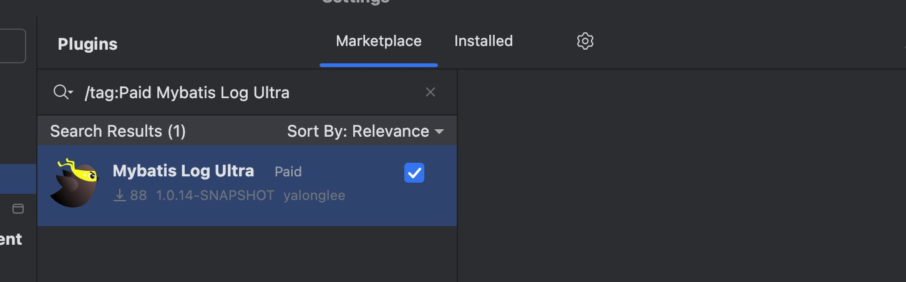
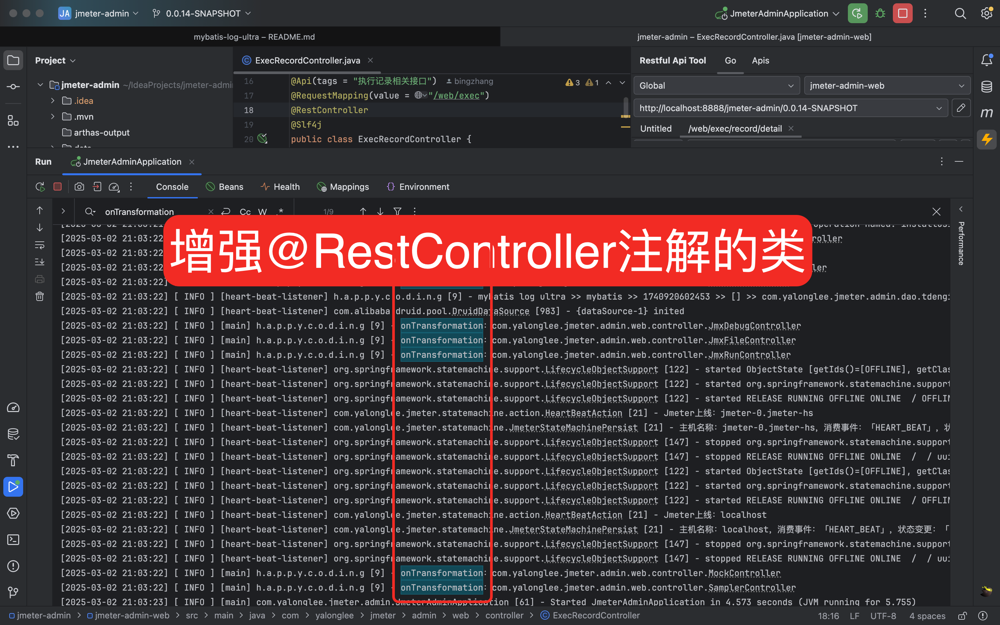
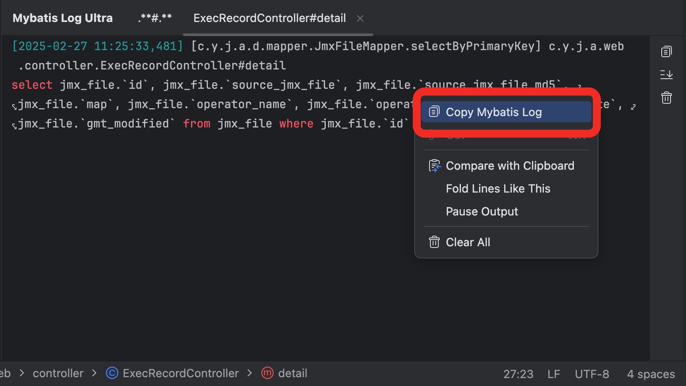
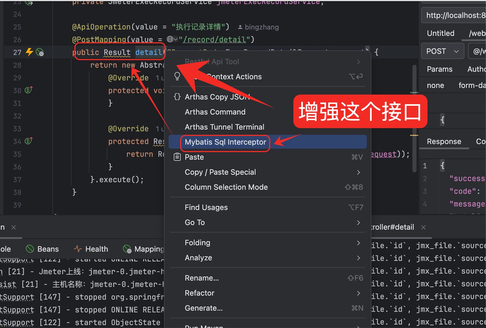
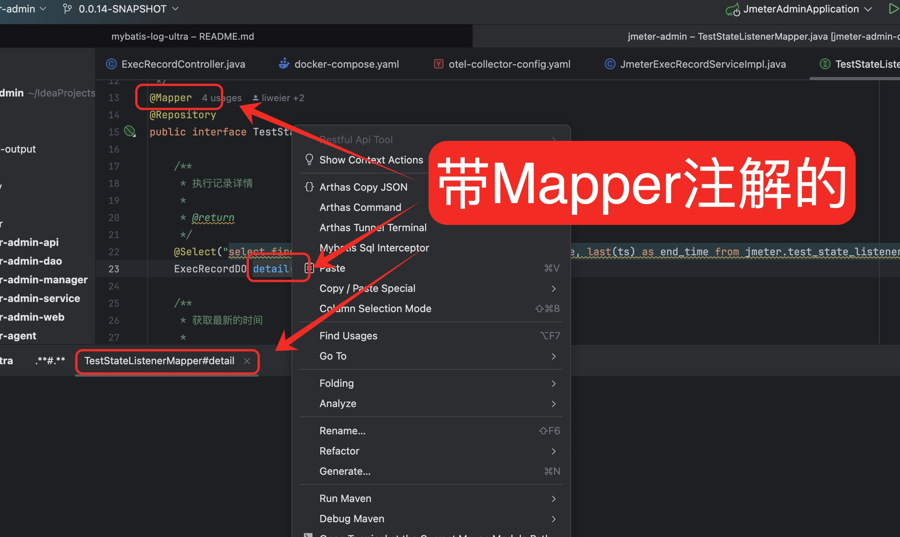

<h2 align="center">mybatis-log-ultra</h2>

<p align="center">
	<strong>为了高效，为了便捷</strong>
</p>

<p align="center">
    <a href="http://www.apache.org/licenses/LICENSE-2.0.html" target="_blank">
        
    </a>
    <a>
        
    </a>
    <a>
        
    </a>
</p>

## 一、简介

`提取SQL还是太繁琐了，需要配置、拼接、日志滚动太快，希望这款插件能为你节约点时间`

`为什么是ultra？因为小米su7 ultra`

`距离插件发布上架才两周时间，这只是一个开始，如果你也觉得这是一个不错的想法，请留下您的使用体验和建议，衷心感谢！🙏🙏🙏🙏`

`插件市场搜索：/tag:Paid Mybatis Log Ultra`

<table>
    <tr>
        <td></td>
    </tr>
</table>

## 二、要求

<p>
    <a>
        
    </a>
    <a>
        
    </a>
    <a>
        
    </a>
    <a>
        
    </a>
</p>

## 三、你的痛点问题

1、需要添加mybatis的配置

2、日志滚动太快，难以查找、难以选中

3、SQL和参数是单独打印，还需要手动进行拼接

4、只输出部分SQL需修改配置，还需要重启

## 四、操作手册

### 1、默认情况下，项目启动即自动拦截所有的@RestController注解的类
<table>
    <tr>
        <td></td>
    </tr>
</table>

### 2、请求接口即可获取到完整可执行的SQL
<table>
    <tr>
        <td></td>
    </tr>
</table>

### 3、快速的拷贝SQL语句
<table>
    <tr>
        <td></td>
    </tr>
</table>

### 4、普通方法也是独立进行输出

<table>
    <tr>
        <td></td>
    </tr>
</table>

### 5、@Mapper注解的接口也同样支持

<table>
    <tr>
        <td></td>
    </tr>
</table>

## 五、功能规划中。。。

#### 1、提供更多的快捷操作，例如：格式化、预览、复制、搜索..等等，尽可能在当前页面完成

#### 2、远程环境也可以动态增强，输出完整的sql到文件，类似是arthas的使用方式，让本地和远程拥有相似的体验

```shell
# 类似这样的命令
java -jar mybatis-log-ultra-boot.jar '${pid}' '${class}' '${method}'
```

## 六、一个粗糙的开始，就是好的开始

