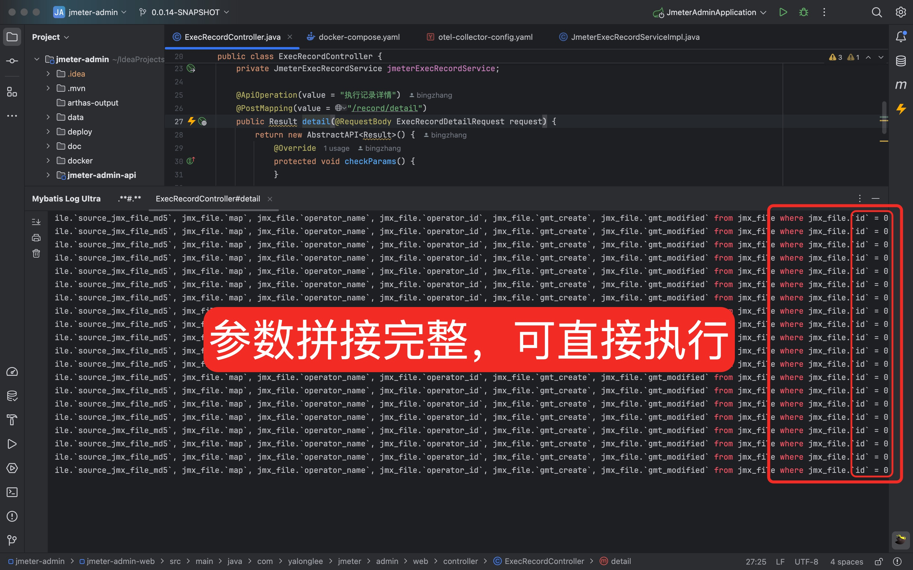
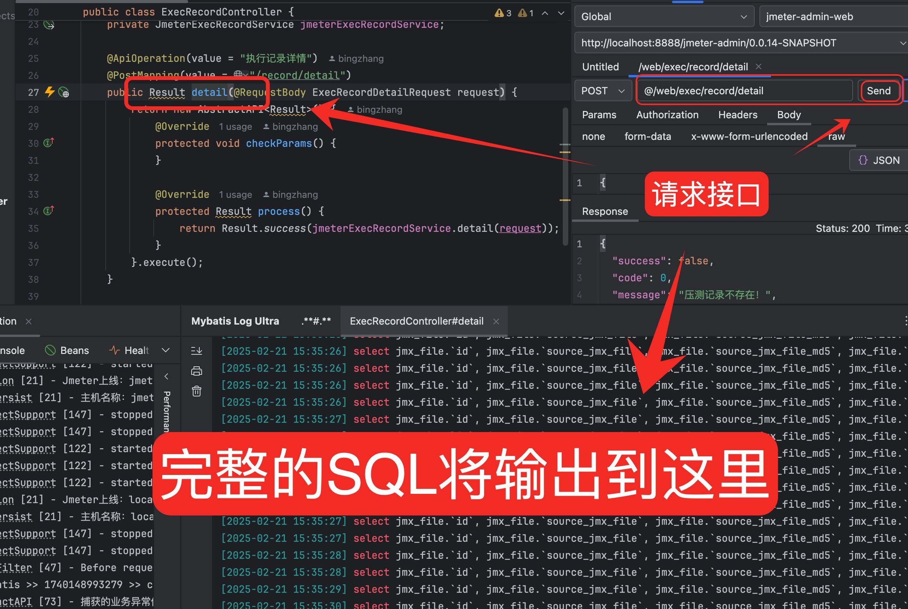

<h2 align="center">mybatis-log-ultra</h2>

	<strong>一切为了效率</strong>

    
    
    

### 一、简介

`在运行的本地项目中提取完整的SQL语句还是太繁琐了，需要配置、拼接，如果日志滚动的太快还难以定位，开发这款插件的目的，就是为了节省时间`

### 二、支持的场景

- 支持对单个接口内执行的SQL进行拦截，自动拼接参数后输出到控制台，可以直接执行

- 支持拦截使用了@Mapper注解的接口方法
