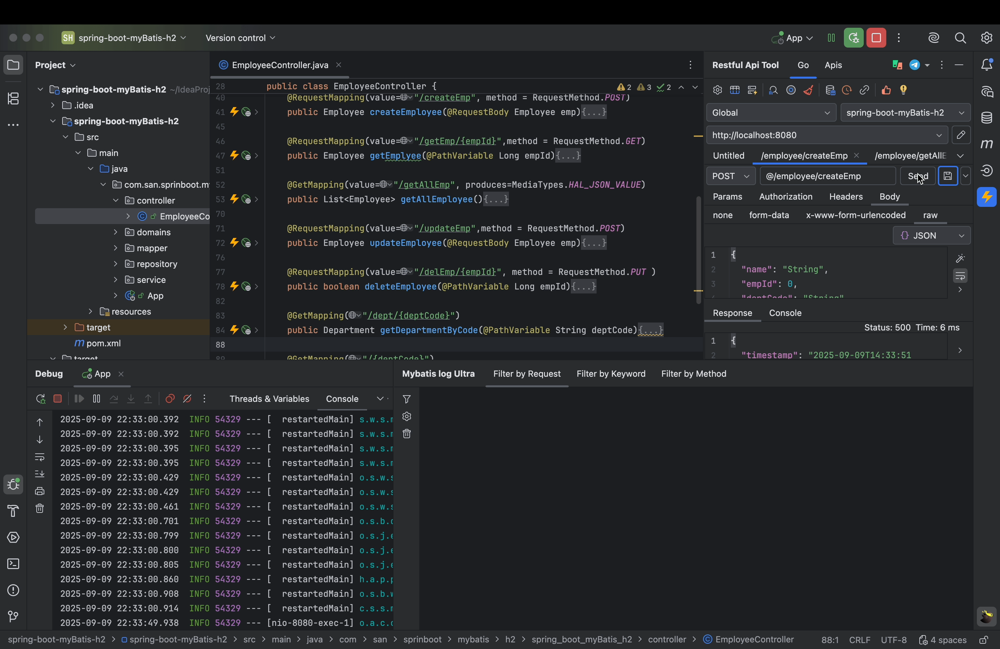
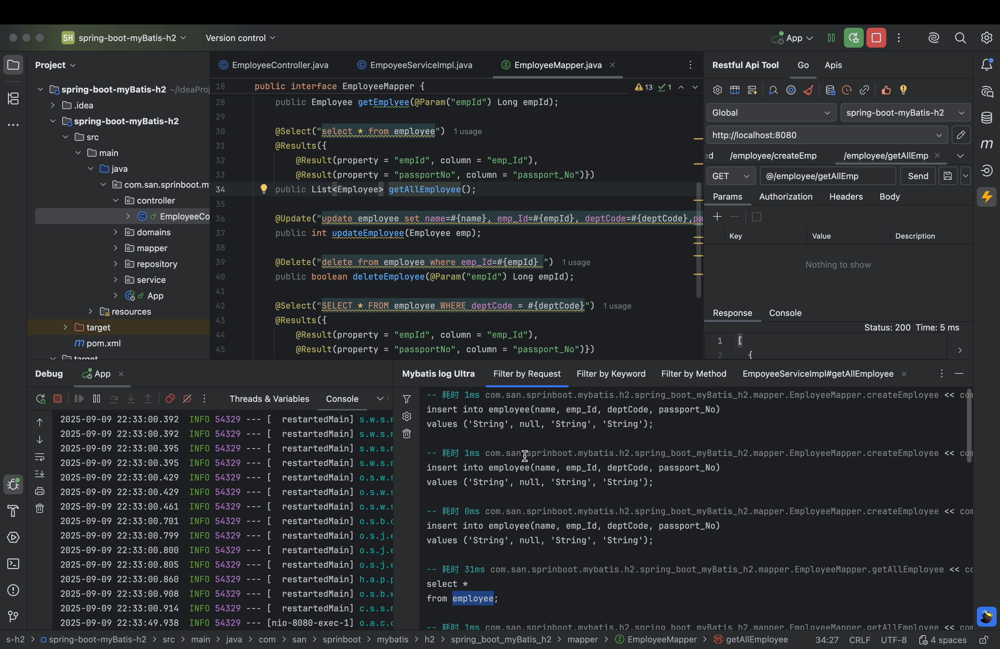

	<strong>简单、高效、便捷</strong>

    
    
    
    

## 一、简介

关于MyBatis Log Ultra，这是MyBatis Log 插件的增强版本，专为提升 MyBatis SQL 调试效率设计。

## 二、解决你的痛点问题

1、无需配置

2、按请求、关键字、函数三个维度精准筛选SQL语句

## 三、展示

<table>
    <tr>
        <td></td>
    </tr>
    <tr>
        <td></td>
    </tr>
    <tr>
        <td></td>
    </tr>
    <tr>
        <td></td>
    </tr>
</table>

