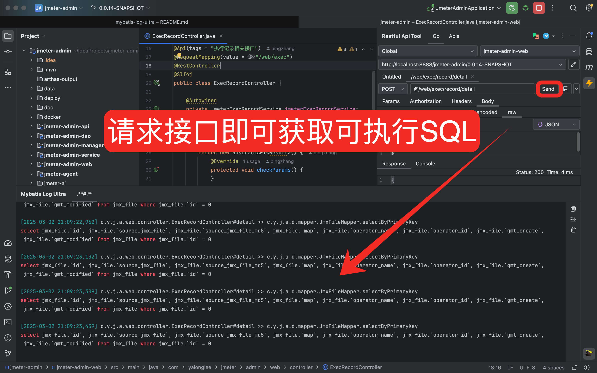
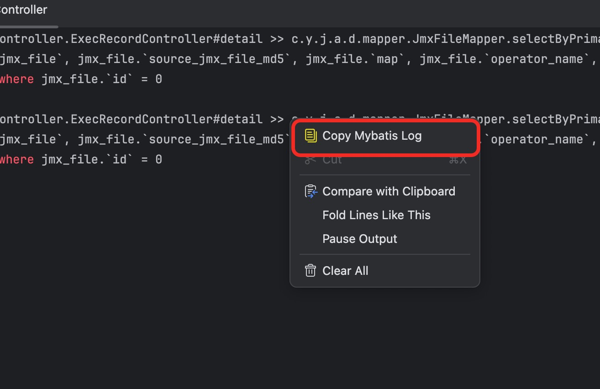
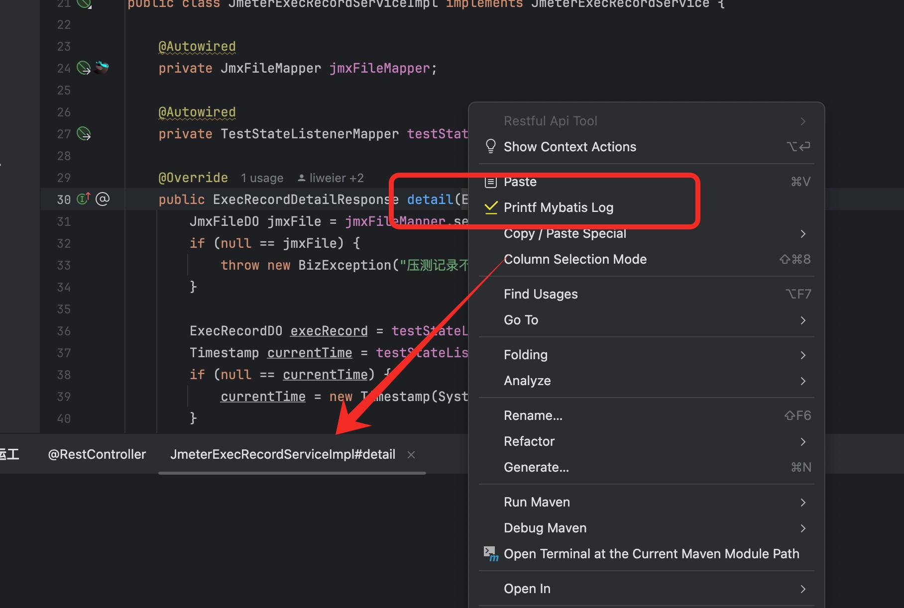

<h2 align="center">mybatis-log-ultra</h2>

<p align="center">
	<strong>简单、高效、便捷</strong>
</p>

<p align="center">
    <a href="http://www.apache.org/licenses/LICENSE-2.0.html" target="_blank">
        
    </a>
    <a>
        
    </a>
    <a>
        
    </a>
</p>

## 一、简介

`如果你只想看某个接口或者某个方法下执行的SQL，那么它再合适不过了。`

`为什么是ultra？因为小米su7 ultra`

`插件市场下载：https://plugins.jetbrains.com/plugin/26550-mybatis-log-ultra`

## 二、演示

<table>
    <tr>
        <td></td>
    </tr>
</table>

## 三、要求

<p>
    <a>
        
    </a>
    <a>
        
    </a>
    <a>
        
    </a>
    <a>
        
    </a>
</p>

## 四、是你的痛点问题？？？？

1、需要添加mybatis的配置

2、日志滚动太快，难以查找、难以选中

3、SQL和参数是单独打印，还需要手动进行拼接

4、只输出部分SQL需修改配置，还需要重启

## 五、已完成的功能点

### 1、请求接口即可获取到完整可执行的SQL
<table>
    <tr>
        <td></td>
    </tr>
</table>

### 2、快速的拷贝SQL语句
<table>
    <tr>
        <td></td>
    </tr>
</table>

### 3、可以对某个普通方法单独增强，独立输出日志

<table>
    <tr>
        <td></td>
    </tr>
</table>

## 六、规划中。。。

#### 1、提供更多的快捷操作，例如：格式化、预览、复制、搜索..等等，尽可能在当前页面完成

#### 2、远程环境也可以动态增强，输出完整的sql到文件，类似是arthas的使用方式，让本地和远程拥有相似的体验

```shell
# 类似这样的命令
java -jar mybatis-log-ultra-boot.jar '${pid}' '${class}' '${method}'
```

## 七、一个粗糙的开始，就是好的开始

